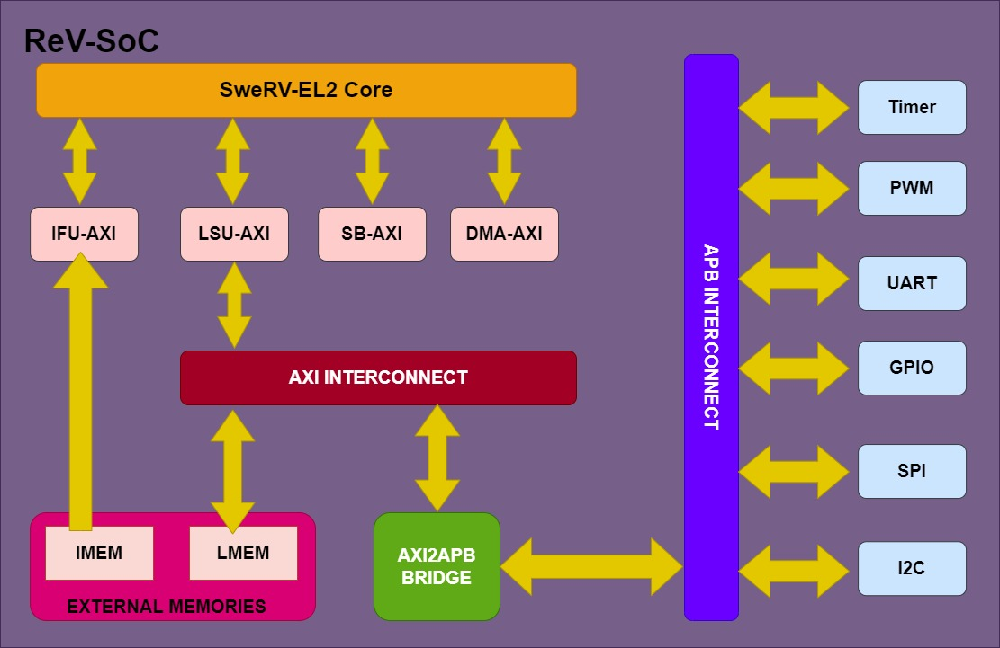

# ReV-SoC SweRV-EL2 RISC-V Core<sup>TM</sup> 1.0 from Micro Electronics Research Lab
This repository contains the ReV-SoC based on EL2 RISC-V SweRV Core<sup>TM</sup>  design RTL

## Directory Structure

    ├── configs                 # Configurations Dir
    │   └── snapshots           # Where generated configuration files are created
    ├── design                  # Design root dir
    │   ├── apb_interconnect    # APB interconnect
    │   ├── axi2apb_bridge      # AXI to APB bridge
    │   ├── axi_interconnect    # AXI Interconnect
    │   ├── dbg                 #   Debugger
    │   ├── dec                 #   Decode, Registers and Exceptions
    │   ├── dmi                 #   DMI block
    │   ├── exu                 #   EXU (ALU/MUL/DIV)
    │   ├── gpio                #   GPIO PERIPHERAL
    │   ├── ifu                 #   Fetch & Branch Prediction
    │   ├── include             
    │   ├── lib
    │   └── lsu                 #   Load/Store
    │   ├── pwm                 #   PWM PERIPHERAL
    │   ├── spi                 #   SPI PERIPHERAL
    │   └── timer               #   TIMER PERIPHERAL
    ├── docs
    │   ├── gpio_docs
    │   ├── pwm_docs
    │   ├── spi_docs
    │   ├── SweRV_EL2_docs
    │   ├── timer_docs
    │   └── uart_docs
    ├── images
    ├── presentations
    ├── tools                   # Scripts/Makefiles
    └── testbench               # (Very) simple testbench
    │   ├── asm                 #   Example assembly files
    │   ├── hex                 #   Canned demo hex files
    │   └── tests               #   Example tests
    |       └── dhry
 
## Dependencies
### Xcelium or Verilator Must be installed
- Verilator **(4.102 or later)** must be installed on the system if running with verilator
- If adding/removing instructions, espresso must be installed (used by *tools/coredecode*)
- RISCV tool chain (based on gcc version 8.3 or higher) must be
installed so that it can be used to prepare RISCV binaries to run.

## Quickstart guide
1. Clone the repository
1. Setup RV_ROOT to point to the path in your local filesystem
1. Determine your configuration {optional}
1. Run make with tools/Makefile

### Configurations

SweRV can be configured by running the `$RV_ROOT/configs/swerv.config` script:

`% $RV_ROOT/configs/swerv.config -h` for detailed help options

For example to build with a DCCM of size 64 Kb:  

`% $RV_ROOT/configs/swerv.config -dccm_size=64`  

This will update the **default** snapshot in ./snapshots/default/ with parameters for a 64K DCCM.  

Add `-snapshot=dccm64`, for example, if you wish to name your build snapshot *dccm64* and refer to it during the build.  

There are 4 predefined target configurations: `default`, `default_ahb`, `typical_pd` and `high_perf` that can be selected via 
the `-target=name` option to swerv.config. **Note:** that the `typical_pd` target is what we base our published PPA numbers. It does not include an ICCM.

**Building an FPGA speed optimized model:**
Use ``-fpga_optimize=1`` option to ``swerv.config`` to build a model that removes clock gating logic from flop model so that the FPGA builds can run at higher speeds. **This is now the default option for
targets other than ``typical_pd``.**

**Building a Power optimized model (ASIC flows):**
Use ``-fpga_optimize=0`` option to ``swerv.config`` to build a model that **enables** clock gating logic into the flop model so that the ASIC flows get a better power footprint. **This is now the default option for
target``typical_pd``.**

This script derives the following consistent set of include files :  

    ./snapshots/default
    ├── common_defines.vh                       # `defines for testbench or design
    ├── defines.h                               # #defines for C/assembly headers
    ├── el2_param.vh                            # Design parameters
    ├── el2_pdef.vh                             # Parameter structure
    ├── pd_defines.vh                           # `defines for physical design
    ├── perl_configs.pl                         # Perl %configs hash for scripting
    ├── pic_map_auto.h                          # PIC memory map based on configure size
    └── whisper.json                            # JSON file for swerv-iss
    └── link.ld                                 # default linker control file


### Building a model

While in a work directory:

1. Set the RV_ROOT environment variable to the root of the SweRV directory structure.
Example for bash shell:  
    `export RV_ROOT=/path/to/swerv`  
Example for csh or its derivatives:  
    `setenv RV_ROOT /path/to/swerv`
    
1. Create your specific configuration

    *(Skip if default is sufficient)*  
    *(Name your snapshot to distinguish it from the default. Without an explicit name, it will update/override the __default__ snapshot)* 
    For example if `mybuild` is the name for the snapshot:

     
    `$RV_ROOT/configs/swerv.config [configuration options..] -snapshot=mybuild`  
    
    Snapshots are placed in ./snapshots directory


1. Running a simple Hello World program (Xcelium)

    `make -f $RV_ROOT/tools/Makefile irun-build`

This command will build a xcelium model of ReV-SoC with AXI bus, and
execute a short sequence of instructions that writes out "HELLO WORLD"
to the bus.

    
The simulation produces output on the screen like: u 
```

xcelium> run
----------------------------------
Hello World from SweRV EL2 @WDC !!
----------------------------------
TEST_PASSED

Finished : minstret = 437, mcycle = 922
See "exec.log" for execution trace with register updates..

Simulation complete via $finish(1) at time 9280 NS + 0
./testbench/tb_top.sv:342             $finish;
xcelium> exit

```
The simulation generates following files:

 `console.log` contains what the cpu writes to the console address of 0xd0580000.  
 `exec.log` shows instruction trace with GPR updates.  
 `trace_port.csv` contains a log of the trace port.  
 When `debug=1 gui=1` is provided, the simulation will run in gui mode on simvision.
  
You can re-execute simulation using:  
    `make -f $RV_ROOT/tools/Makefile irun`


  
The simulation run/build command has following generic form:

    make -f $RV_ROOT/tools/Makefile [<simulator>] [debug=1] [gui=1] [snapshot=mybuild] [target=<target>] [TEST=<test>] [TEST_DIR=<path_to_test_dir>]

where:
``` 
<simulator> -  can be 'verilator' (by default) 'irun' - Cadence xrun, 'vcs' - Synopsys VCS, 'vlog' Mentor Questa
               'riviera'- Aldec Riviera-PRO. if not provided, 'make' cleans work directory, builds verilator executable and runs a test.
debug=1     -  allows VCD generation for verilator and VCS and SHM waves for irun option.
gui=1       -  enables simvision to take control and run simulation in gui mode
<target>    -  predefined CPU configurations 'default' ( by default), 'default_ahb', 'typical_pd', 'high_perf' 
TEST        -  allows to run a C (<test>.c) or assembly (<test>.s) test, hello_world is run by default 
TEST_DIR    -  alternative to test source directory testbench/asm or testbench/tests
<snapshot>  -  run and build executable model of custom CPU configuration, remember to provide 'snapshot' argument 
               for runs on custom configurations.
CONF_PARAMS -  allows to provide -set options to swerv.conf script to alter predefined EL2 targets parameters
```
## RUNNING C TEST ON ReV-SoC
If you wish to run any C test on SoC then you just need to write a test just like a test provided in testbench/tests/Ctest.c
Now place it in same directory testbench/tests/Ctest.c 
Now you need to run the command given below just change the cmark to the filename of your test from TEST=Ctest
     
    make -f $RV_ROOT/tools/Makefile irun TEST=Ctest

will build and simulate the test using Cadence xrun


The Makefile uses  `snapshot/<target>/link.ld` file, generated by swerv.conf script by default to build test executable.
User can provide test specific linker file in form `<test_name>.ld` to build the test executable,
in the same directory with the test source.

User also can create a test specific makefile in form `<test_name>.makefile`, containing building instructions
how to create `program.hex` file used by simulation. The private makefile should be in the same directory
as the test source. See examples in `testbench/asm` directory.

Another way to alter test building process is to use `<test_name>.mki` file in test source directory. It may help to select multiple sources
to compile and/or alter compilation swiches. See examples in `testbench/tests/` directory
 
*(`program.hex` file is loaded to instruction and LSU bus memory slaves and
optionally to DCCM/ICCM at the beginning of simulation)*.

User can build `program.hex` file by any other means and then run simulation with following command:

    make -f $RV_ROOT/tools/Makefile <simulator>

Note: You may need to delete `program.hex` file from work directory, when run a new test.

The  `$RV_ROOT/testbench/asm` directory contains following tests ready to simulate:
```
hello_world       - default test program to run, prints Hello World message to screen and console.log
hello_world_dccm  - the same as above, but takes the string from preloaded DCCM.
hello_world_iccm  - the same as hello_world, but loads the test code to ICCM via LSU to DMA bridge and then executes
                    it from there. Runs on EL2 with AXI4 buses only.
```

The `$RV_ROOT/testbench/hex` directory contains precompiled hex files of the tests, ready for simulation in case RISCV SW tools are not installed.

**Note**: The testbench has a simple synthesizable bridge that allows you to load the ICCM via load/store instructions. This is only supported for AXI4 builds.


----
Micro Electronics Reseach Lab
